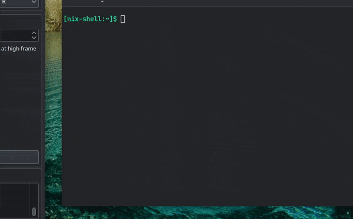

# Griefficient
[](https://www.npmjs.com/package/griefficient) [](https://github.com/Odyssey346/Griefficient/blob/master/LICENSE) 

A command line tool that scans Shodan for Minecraft servers and shows you details about them.


## Install
### repl.it (recommended)
There is a [repl.it available here](https://replit.com/@Odyssey346/Griefficient?v=1)! All you have to do is fork it, go to the Secrets tab and add your Shodan API key to the GRIEFFICIENT_API_KEY secret.

This is perfect if you do not want to install Node.js for a simple project like this, or if you are unable to do so.

I cannot guarantee that I'll update it all the time, and I am not exactly sure how repl.it works (because I'm not that sort of dev).

If you have an issue regarding it, do not add a comment. I do not read repl.it comments, and I will ignore them. [Go make an issue on GitHub instead.](https://github.com/Odyssey346/Griefficient/issues)
### NPM package
You can install it as a global NPM package by running this command:
``npm i -g griefficient``

*note, on Linux, you might have to use sudo or doas to run that command.*

I recommend you to install it through NPM if you just want to use Griefficient, and not develop it.

[Now go set up your environment variables!](#environment-variables)

And now you should be able to run ``griefficient`` in your terminal.
### Manual
```
git clone https://github.com/Odyssey346/Griefficient
cd Griefficient
nix-shell # if you're on NixOS you can just do this, and skip to the last part
npm i
npm run start # Start a thing that restarts Griefficient every time you make a change
```
## Environment Variables
You need to set the ``GRIEFFICIENT_API_KEY`` environment variable to your Shodan API key.

[Guide for Windows](https://docs.oracle.com/en/database/oracle/machine-learning/oml4r/1.5.1/oread/creating-and-modifying-environment-variables-on-windows.html)

[Guide for Linux](https://www.cyberciti.biz/faq/set-environment-variable-linux/)